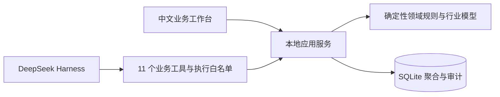

# SmartBusiness 智能商业协作系统

本仓库用于建设覆盖内贸与外贸的市场情报、资源发现、商业模式、营销、交易、交付、利润复盘和 ESG 的业务系统。

当前阶段：**DeepSeek Harness 商业工作台 v0.4，2026-09-18**。已有可运行的中文 Web 工作台、SQLite 持久化、11 个真实 Harness 业务工具，以及新能源和出行两个行业的六个合成案例。候选市场为欧美及国内一二线城市；具体国家/州/城市、供应商和渠道待确定。

优先阅读 [Harness 搭建入口](docs/zh-CN/harness/README.md) 和 [启动与双行业试点](docs/zh-CN/harness/03-启动与双行业试点.md)。行业建模过程见 [两行业落地入口](docs/zh-CN/industries/README.md)。

## 快速运行

需要 Python 3.10+；Harness 另需 Node.js 22.19+（22 系列）或 24+。本轮实测 Windows、Python 3.14、Node 24.21.0。

```text
python -X utf8 -m smartbusiness serve
```

打开 `http://127.0.0.1:8787`，可以录入带来源的情报、建立商机假设、登记候选资源、起草和内部评审营销内容、管理联系人与本地沟通记录、跟踪软件/硬件/合同/ESG 工作项。数据保存在 Git 忽略的 `.smartbusiness/`；页面数据会在重启后保留。

保持服务运行，另开终端安装并启动 Harness：

```text
cd integrations/deepseek-harness
npm ci
cd ../..
python -X utf8 -m smartbusiness harness
```

首次打开终端打印的带本地登录令牌的 Harness 地址，在官方界面配置自己的模型 API 密钥。启动器固定 `@deepseek-ai/dsh@0.1.6-alpha.2`，插件通过服务端校验的业务工具工作；默认白名单拒绝非业务工具。Harness 密钥、会话与配置保存在 `.smartbusiness/harness-home`，不要提交这些本地文件。

## 架构与验证



商业判断由 AI 协助提出，金额计算、状态变更、幂等与权限由领域代码执行。完整的术语、专业视角、DDD、TDD 与生产路线见下列中文文档。

```text
python -X utf8 -m unittest discover -s tests -v
python -X utf8 scripts/check_harness_integration.py
python -X utf8 scripts/check_design_docs.py
cd integrations/deepseek-harness
npm test
```

本地已通过 66 项 Python 测试、15 项官方 ToolRuntime 插件测试，以及真实 Harness 工具 → HTTP → 领域规则 → 临时数据库的 11 工具联调。官方 Harness Web 已实际启动并加载插件；真实模型调用未测试，需配置用户自己的 API 密钥。

## 当前实现范围

这是本地单操作员试点，适合验证业务过程。行业参数、供应资源和利润均是合成示例；新录入的资料默认待核实。统一社交平台真实收发、自动采集与发布、正式合同签署、CAD/BOM、软件部署、完整 ESG 报告、生产多租户和五端安装包尚待开发或接入。原生五端路线与完整闭环见 [生产演进](docs/zh-CN/harness/04-完整闭环与生产演进.md)，各需求状态见 [交付追踪](docs/zh-CN/harness/05-需求测试追踪与过程记录.md)。

## 阅读顺序

严格按词汇 → 多领域分析 → 需求挖掘 → 领域模型 → 技术设计 → 测试与迭代的顺序阅读和演进。

1. [范围、假设与需求挖掘](docs/zh-CN/00-范围与需求挖掘.md)
2. [专业词汇与统一语言](docs/zh-CN/01-专业词汇与统一语言.md)
3. [多领域专家视角分析](docs/zh-CN/02-多领域专家视角分析.md)
4. [业务需求与验收标准](docs/zh-CN/03-业务需求与验收标准.md)
5. [事件风暴与业务流程](docs/zh-CN/04-事件风暴与业务流程.md)
6. [DDD 战略设计](docs/zh-CN/05-DDD战略设计.md)
7. [DDD 战术设计](docs/zh-CN/06-DDD战术设计.md)
8. [社交渠道与统一沟通](docs/zh-CN/07-社交渠道与统一沟通.md)
9. [多端架构与数据设计](docs/zh-CN/08-多端架构与数据设计.md)
10. [合同、硬件与 ESG 专项](docs/zh-CN/09-合同硬件与ESG专项.md)
11. [TDD 与质量策略](docs/zh-CN/10-TDD与质量策略.md)
12. [实施路线与追踪矩阵](docs/zh-CN/11-实施路线与追踪矩阵.md)
13. [架构决策记录](docs/zh-CN/12-架构决策记录.md)
14. [研究来源与核实状态](docs/zh-CN/13-研究来源与核实状态.md)
15. [全过程记录与文档规范](docs/zh-CN/14-全过程记录与文档规范.md)
16. [贸易、资源、商业模式与营销闭环](docs/zh-CN/15-贸易资源商业模式与营销闭环.md)

“专家视角分析”是 AI 辅助预分析，尚未真人会审。行业内核已有本地测试结果，通用文档保留 v0.2 的阶段记录；生产架构、渠道、场址和车型要求仍须实际验证。
