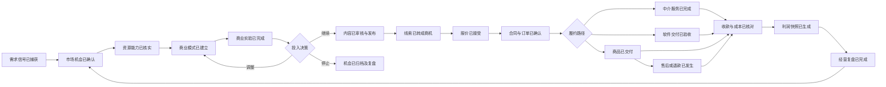

# 04 事件风暴与业务流程

这是基于已整理词汇与跨专业分析的桌面推演，尚未举行真人 EventStorming 工作坊。中文事件均用过去式；待验证规则标为候选。

## 1. 主闭环

资源、合同和收款并非固定串行：可先获订金再交付；可为实验先采购样品。上图表示价值流，不强制一个统一状态机。ESG 从授权的采购、生产、人员和治理记录获取数据，不假设每单都能自动形成完整 ESG 数据。

## 2. 命令—事件—规则—读模型

|执行人 / 命令|事件|候选业务规则|下游 / 读模型|
|---|---|---|---|
|分析员 / 捕获信号|SignalCaptured|来源与采集权限必填|情报收件箱|
|产品 / 确认需求|RequirementConfirmed|来源、责任人和验收例齐全|需求地图、市场机会|
|资源经理 / 核实能力|CapabilityVerified|必须附可审查证据与有效期|候选资源对比|
|经营者 / 提交商业模式|BusinessModelSubmitted|说明收费、成本、资源和失败条件|模式画布|
|实验负责人 / 完成实验|ExperimentCompleted|保存观测、样本、预算与异常；不得改写原阈值|验证看板|
|决策人 / 批准投入|InvestmentApproved|硬约束通过、预算获授权、版本未变|资源安排、营销计划|
|编辑 / 审核内容|ContentApproved|事实和素材权利可核对|可发布内容池|
|运营 / 请求发布|PublicationRequested|内容版本与审批一致、账号权限有效|发布日历|
|适配器 / 记录发布结果|ContentPublished|有平台 ID 或经核实的人工证据|归因触点|
|销售 / 接受报价|SalesQuoteAccepted|未过期、币种与交易条件明确|订单待确认|
|合同经理 / 记录签署完成|ContractExecuted|证据核实且满足本合同生效规则|义务与订单解锁|
|交付负责人 / 请求验收|AcceptanceRequested|交付物与基线、验证结果齐全|客户待验收事项|
|授权人 / 确认验收|DeliveryAccepted|按约定方式记录授权客户的认定证据|结算触发候选|
|财务 / 核对收付与成本|SettlementReconciled|外部凭证唯一、差异有处理记录|利润快照|
|经营者 / 完成复盘|BusinessReviewCompleted|区分预期、实际、未知与原因|下轮假设、停止/扩大决定|
|ESG 复核人 / 发布报告|ESGReportPublished|报告输入冻结、披露差距标明、复核完成|报告库|

“事件触发候选”只生成待办，不自动越权履行采购、签约、付款或客户外发。

## 3. 关键异常流程

### 会话产生需求
收到消息 → 验签与持久化 → 按外部 ID 去重 → 建会话投影 → 提取诉求建议 → 人工确认需求。消息撤回后，引用标记状态改变并按保留规则处理；历史需求不静默消失。无权用于需求分析的消息不得送入 AI。

### 决策失效
批准后关键证据过期、资源不可用或成本偏差超限 → 产生 ReassessmentRequired → 暂停新投入任务 → 重新审批。已签约义务不能通过“撤销决策”自动取消。

### 合同或工程变更
ChangeRequested → 需求、报价、BOM、软件、交期及利润影响评估 → 相关负责人审批 → 按生效条件更新基线 → 重建未完成工作计划。已生产、已发货、已付款部分单独处理，不能数据库回滚掉真实世界事实。

### 发送或发布未知
网络超时但供应商可能已接受 → DeliveryUnknown/PublicationUnknown → 有查询能力则查询 → 有幂等能力按原键重试 → 两者皆无则转人工核对。不能盲目重发造成重复承诺或重复内容。

### 退款和利润更正
RefundRequested → 授权确认 → 记录外部退款事实 → 退货/售后协同 → 收入与成本调整 → 新利润快照 → 更新营销归因结果。退款改变归因收益，但保留原始触点。

## 4. 长事务协调示例

OrderFulfillmentProcess 只记录流程进度和跨域引用，不能修改别的聚合内部状态。

1. TradeOrderConfirmed 后分别请求库存/采购可用性、合同前置条件和交付排程。
2. 每步返回确认或明确失败；以 orderId + step + revision 幂等处理。
3. 部分失败时：未承诺资源可释放；未发布内容可取消；已签合同或已付款仅创建人工处理/退款申请。
4. 过期步骤产生告警和待办，保留重试次数、下次执行时间、错误原因与负责人。
5. 流程终态包含成功、取消、失败待处置；不能用“消息发出”表示业务完成。

## 5. 工作坊热点清单

哪些证据足够确认需求？资源核实有效期多长？允许多少实验预算？何时获得佣金？税费和运费由谁承担？谁能代表客户验收？成本完整到什么程度可称已核对利润？报告边界如何变化？这些必须由具体业务样本确定。
