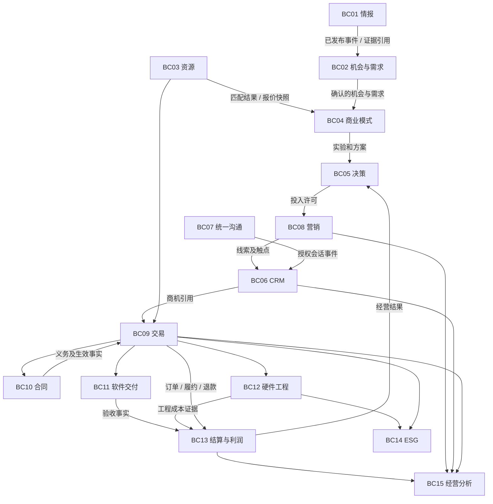

# 05 DDD 战略设计

输入：词汇 v0.2、多领域分析 D01–D14、需求 R01–R23 和事件推演。模型为候选版。

## 1. 子域分类

核心域建议为“机会与需求、资源匹配、商业模式与实验、决策复盘”，竞争力在于让需求和资源转化为可验证盈利路径。具体排序可因业务变化调整。

营销、客户、交易、合同、软硬件交付和 ESG 为支撑域；身份权限、附件存储、通知和审计为通用能力。利润核算是闭环的必要支撑，若未来产品优势集中在经营优化，可升级为核心域。复杂并不自动意味着核心。

## 2. 限界上下文与数据所有权

这是逻辑边界，**不等于立即部署 17 个微服务**。初期可在一个模块化单体中实现，仅开发首期切片需要的模块。

|上下文|负责的模型与事实|不负责 / 外部权威|
|---|---|---|
|BC01 情报 Intelligence|Source、Evidence、IntelligenceItem、Claim|需求批准和客户承诺|
|BC02 机会与需求 Discovery|MarketOpportunity、Requirement、Baseline|具体客户销售商机、工作项|
|BC03 资源网络 Resources|ResourcePartner、CapabilityProfile、ResourceMatch、RFQ/SupplierQuote|采购付款、真实库存记账|
|BC04 商业模式 Venture|BusinessModel、Experiment、Offering 草案|最终投入批准、成交收入|
|BC05 决策 Decisions|DecisionCase、DecisionRecord、Review|执行域的合同、发布和采购授权|
|BC06 客户经营 CRM|CustomerAccount、Contact、IdentityLink、Lead、Opportunity、ServiceTicket|渠道消息原件与合同主体历史|
|BC07 统一沟通 Conversations|ChannelAccount、Conversation、Message、发送任务|公开内容发布、跨渠道身份合并|
|BC08 营销 Marketing|Campaign、ContentAsset、PublicationJob、Touchpoint、AttributionModel|CRM 客户事实、利润账目|
|BC09 交易与贸易 Commerce|可销售 Offering、SalesQuote、TradeOrder、采购/运输协调、售后申请|库存/财务外部系统的权威记账|
|BC10 合同 Contracts|Contract、PartySnapshot、Clause、Obligation、Amendment|法院认定、企业总账|
|BC11 软件交付 SoftwareDelivery|DeliveryProject、WorkItem、Release、Acceptance|Git 原始代码和 CI 运行事实|
|BC12 硬件工程 Hardware|Part、BOMRevision、DesignBaseline、ECO、Prototype、TestRun|CAD 编辑器、全量 MES/WMS|
|BC13 结算与利润 FinanceOps|收付/成本证据、对账、分摊规则、ProfitSnapshot|未经专业确认的法定会计结论|
|BC14 可持续信息 ESG|Boundary、MetricDefinition、Observation、Factor、Report|自动认定适用法律、独立鉴证|
|BC15 经营分析 Analytics|跨域只读投影、指标定义映射、业务链追踪|事务写入；不反向更新来源事实|
|BC16 组织权限与审计 Governance|Tenant、Membership、Role、Policy、Audit、RetentionPolicy|各业务域的具体审批规则|
|BC17 证据文件服务 EvidenceStore|文件、哈希、扫描状态、保留状态与访问标签|领域对材料有效性、会计/法律效力的判断|

同一组织可以既是客户又是供应商，但 CustomerAccount 与 ResourcePartner 分别建模并用合法授权的 PartyReference 关联，不做“超级客户供应商实体”。

## 3. 上下文关系图

Governance 与 EvidenceStore 为各域提供受控接口，图中省略交叉线以便阅读。

## 4. 关系契约

|上游 → 下游|DDD 关系|契约与变化处理|
|---|---|---|
|情报 → 需求|客户/供应方 + 发布语言|输出带版本证据引用；下游保留自己的需求解释|
|需求 → 商业模式/交付|发布语言|RequirementBaselinePublished；下游引用固定版本|
|资源 → 商业模式/交易|客户/供应方|能力/报价快照并含有效期；交易承诺由交易域确认|
|营销 → CRM|发布语言 + 防腐层|MarketingLeadCaptured 转换为 CRM Lead，不共享实体|
|外部社交 → 沟通|防腐层|外部用户、消息和状态翻译；原始 payload 受控留存|
|外部社交 → 营销|防腐层|发布、内容状态、统计分别映射|
|CRM → 合同|客户/供应方|只提供主体参考；合同固化法定主体快照|
|合同 ↔ 交易|合作关系 + 明确接口|生效与变更事件、订单引用；无共享可变表|
|Git/CI → 软件交付|防腐层|提交、构建和测试证据；业务验收仍属交付域|
|CAD/PLM/WMS → 硬件/交易|防腐层|文件修订和库存引用；确定每种数据的唯一权威源|
|财务系统 → 结算利润|防腐层|导入凭证、科目映射和调整事实；不得自行覆盖财务结果|
|各域 → Analytics/ESG|发布语言 + 下游翻译|授权事实投影；ESG 做口径映射和复核，不能直接拼表算报告|

共享内核仅保留稳定标识和事件信封约定；Money 等相似值对象可按域独立实现，避免共享业务类形成耦合。

## 5. 边界验证

一项业务操作若必须同时修改两个上下文才能保持不变量，先检查是不是边界划错；确属跨域流程则使用明确的中间状态、可靠事件和补偿。比如“批准发布”与“平台可见”本来就不具备原子性。

只有出现独立伸缩、显著隔离要求、独立团队和发布节奏，且已有可观察的接口契约时才拆服务。优先可拆外部渠道适配器、媒体处理和 AI 作业；核心交易边界先保持简单。
