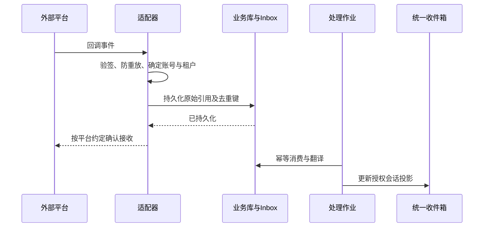

# 07 社交渠道与统一沟通

## 1. 能力范围

统一的是操作入口、客户关联、指派、跟进和证据链。每个平台仍有独立账号身份、授权范围、回复窗口、消息类型和计费策略。用户尚未指定首批平台。

能力标记分为“文档核实”“仅发现官方入口”“未核实”“真实账号联调通过”。截至 2026-09-18，**没有任何渠道完成真实账号联调**。文档可行不代表用户账号已获权限。

## 2. 客户沟通渠道候选矩阵

|渠道 / 账号类型|拟接入范围|当前证据与限制|首期策略|
|---|---|---|---|
|微信客服 / 企业授权入口|客服会话收发、分配、客户关联候选|官方文档页本次抓取失败；收发范围、窗口、资质和费用待核实 S10|国内优先验证候选；未获权限前只提供人工记录/跳转|
|企业微信客户联系 / 会话存档|客户关联与获授权的归档候选|不把客户联系、会话存档和客服回复视为同一种能力；资质及授权待核实|分别做适配器可行性验证，不承诺任意代员工发送|
|微信公众号|关注者互动/客服候选|账号类型、接口权限、回复窗口待核实|与微信客服独立登记|
|个人微信 / QQ 个人账号|用户希望统一沟通的潜在需求|未核实有满足本项目要求的官方通用接口|不承诺全量私信/群聊接管；保留手工线索与原应用跳转|
|WhatsApp Business Platform|企业客户消息候选|文档核实：联络授权；窗口外模板规则 S03；账号、地区、额度、费用仍待验|海外候选；运行时检查窗口和模板状态|
|Telegram Bot|与机器人交互及获准群消息|文档核实：机器人消息可见性受隐私模式/群权限影响 S04|适合适配器试验；不等价个人账号全部聊天|
|Slack App|授权工作区事件与发消息|文档核实：事件与 OAuth scopes 关联 S05|用于团队/客户协作，按授权会话范围接入|
|Microsoft Teams App/Bot|获准安装位置的会话与通知|文档核实：主动消息需要相应安装/访问条件 S06|按租户授权和应用安装验证|
|飞书 / 钉钉企业应用|应用/机器人范围内消息候选|仅发现官方入口，正文未能提取 S11/S12|企业协作候选，不承诺所有员工私聊|
|邮件|授权邮箱收发、线程和附件|供应商 API/OAuth 与保留策略待确定|作为跨平台商务沟通补充，仍须实测|

对个人账号接口未知使用“未核实”而不是武断宣称永远无法接入。禁止把读取历史能力误认为拥有发送权限。

## 3. 内容发布渠道候选矩阵

|平台|内容制作 / 发布路径|当前核实状态|降级|
|---|---|---|---|
|TikTok|视频/图文素材准备与 Content Posting API 候选|官方文档说明未审计客户端有私密可见性限制；公开发布取决于审核和权限 S13|导出素材与发布说明，人工回填链接|
|YouTube|视频、标题、简介与上传候选|官方说明特定未验证 API 项目上传受私密限制 S14|人工上传并回填平台 ID|
|LinkedIn|B2B 文章/帖子与企业内容候选|本次 API 页面无法核实；需查当前 Posts API 权限与产品准入|发布包与人工核验|
|微信公众号 / 视频号|文章/视频制作与发布候选|具体账号、API 能力、审核待核实|保存稿件和素材，转官方后台|
|抖音 / 小红书|脚本、图文和平台规格版本|官方接口、商业账号条件与发布能力待核实|同上，不用登录 Cookie 或逆向协议替代正式接入|
|独立站 / 企业 CMS|内容结构化输出与发布适配器|待选定已有 CMS 后验证|下载发布包或草稿导入|

制作能力不依赖外发权限：可先做选题、文案、翻译、视频脚本和素材库。生成图片/视频的模型供应商另行选型，预算、版权来源和数据政策纳入评审。

## 4. 适配器协议（设计接口）

每个适配器暴露 capability descriptor，包含：
- 可接收/可发送消息类型、是否支持历史同步、编辑/撤回、投递/已读回执；
- 是否支持内容发布、定时/草稿、查询发布结果、统计读取和删除；
- 账号作用域、权限列表、额度、媒体上限、回复窗口策略版本；
- 是否支持供应商幂等键、结果查询和 Webhook 签名验证；
- 文档核查时间、账号联调状态、限制说明。

应用层接口候选：ReceiveEvent、FetchUpdates、SendMessage、GetDeliveryStatus、PublishContent、GetPublicationStatus、FetchMetrics、RefreshAuthorization。未实现能力返回 CapabilityUnsupported，不伪造成功。

## 5. 收发可靠性

- Webhook 确认时限按平台要求实现，处理耗时任务移至异步；数据库不可用时不假确认成功。
- 入站唯一键候选为 tenantId + provider + accountId + providerEventId；没有稳定 ID 时需平台特定去重规则，并记录碰撞与误判风险。
- 出站先保存发送意图和 Outbox，再由作业重新检查授权/窗口后执行。排期时通过不代表执行时仍通过。
- 区分永久错误（无权限、目标失效）和暂时错误（限流、网络），采用退避、抖动、限次重试与死信处置。
- 回调可能乱序；已读/送达不得被迟到的受理回执降级。未提供该类回执时显示“平台未提供”。
- 对“请求超时但平台可能已接受”的未知结果执行查询/核对策略，禁止简单重发。
- 人工发送或发布记录必须附操作者、时间、链接/凭证与核实状态，和 API 自动回执区别展示。

## 6. 客户身份与产品界面

统一收件箱：左侧渠道/团队/待办，中间消息，右侧客户、商机、需求和订单；内部备注与客户外发视觉分离。编辑框始终显示目标账号、目标客户和渠道限制。

客户时间线聚合多个渠道会话但不修改原始会话身份。跨渠道关联只允许已授权的明确联系方式或人工核实；禁止仅用头像和昵称合并。取消关联后重建投影，不删除原始消息事实。

移动端以待办、快速回复和采集为主；桌面支持并排比较、批量整理和证据查看。消息附件继承对应会话的权限和保留策略。

## 7. 每渠道接入验收

真实账号 OAuth/凭据生命周期 → 授权撤回 → 入站/出站 → 附件 → 限流 → 重复/乱序回调 → 超时未知 → 令牌失效 → 客户退订 → 数据导出与删除 → 成本监控。全部记录中文测试结果；无法验证的能力保持关闭。
