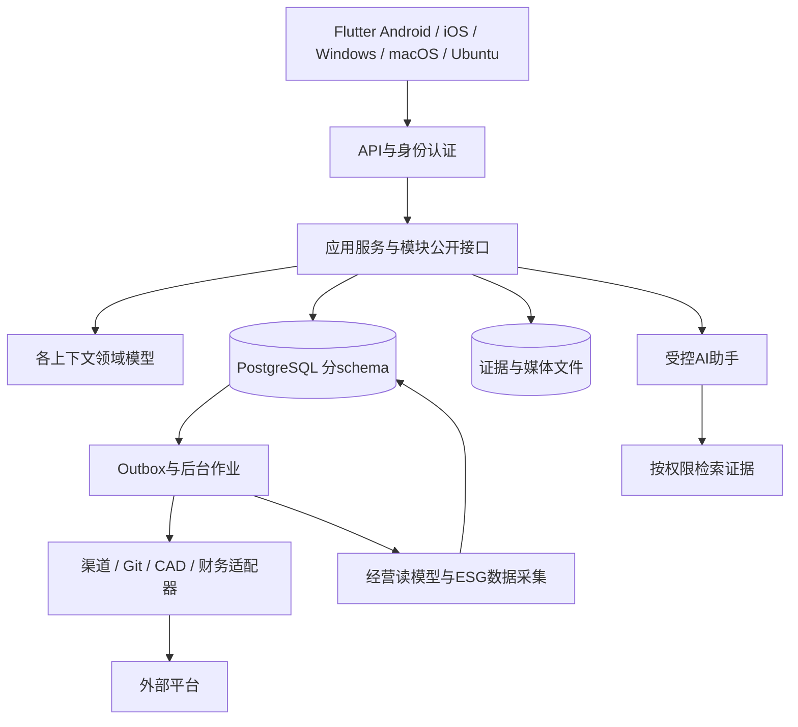

# 08 多端架构与数据设计

## 1. 候选技术方案

|层次|首选建议|理由 / 替代与代价|
|---|---|---|
|客户端|Flutter / Dart|官方支持目标五类平台，适合共享业务界面；插件、输入法、通知、无障碍和文档编辑须逐端验证 S02|
|后端|Java + Spring Boot + Spring Modulith|显式领域模块、成熟事务和模块验证；Kotlin 为团队熟悉时的备选。具体兼容版本在 PoC 后锁定 S16|
|数据|PostgreSQL，按上下文划 schema|统一事务起步，禁止跨模块任意写表；可启用 RLS 增强租户隔离 S17|
|文件|兼容对象存储接口的私有文件库|大附件、图纸、证据及媒体；元数据与正文分离|
|异步|数据库 Outbox + 后台作业起步|初期不用为每个逻辑模块引入消息中间件；需要独立吞吐时增消息代理|
|检索|关系数据库检索先行，复杂时引入专用索引|租户/对象权限必须过滤，向量检索可选|
|AI 编排|独立应用服务与模型适配器|结构化输入输出、证据引用、评测与费用记录；不让模型直接改领域表|
|可观测|结构化日志、指标、分布式关联 ID|消息队列延迟、渠道失败、成本完整度、AI 费用可追踪|
|部署|Ubuntu 服务端容器化，开发环境可本机运行|首期单体应用与作业进程、数据库、对象存储；生产可用性根据预算选择冗余拓扑|

这些是拟采用的技术组合，尚未创建工程或验证兼容版本。当前不固定未经核查的 SDK 最新版本或最低系统版本。

## 2. 部署与模块图



端到端权限校验发生在 API、应用服务和数据读取层；租户身份来自已验证会话，不能信任客户端随意指定的 tenantId。

## 3. 项目结构建议（尚未创建代码）

```text
apps/client/                         # Flutter 五端客户端
services/business/
  modules/discovery/
    domain/                          # 聚合、值对象、规则
    application/                     # 用例、事务与权限
    infrastructure/                  # 仓储与外部适配
    api/                             # 公开协议和模块入口
  modules/resources/                 # 其他上下文按同样边界组织
  modules/venture/
  modules/...
adapters/channels/
contracts/openapi/
contracts/events/
specs/acceptance/                     # 中文验收规格
docs/zh-CN/
```

代码模块可逐步建立，不先生成大量空目录。每个模块公开 API 独立于领域内部实现；构建检查循环依赖和非法跨模块访问。

## 4. 数据结构与权限

主要物理表候选：discovery.requirement/revision/baseline；resources.partner/capability/quote；venture.model/experiment；conversations.message/outbound_request；marketing.content_revision/publication_job/touchpoint；commerce.quote/order；contracts.contract_revision/obligation；finance.receipt/cost_record/reconciliation/profit_snapshot；esg.observation/factor_version/report_snapshot。

公共技术列：tenant_id、id、version、created_at/by、updated_at/by；重要业务事实另有 occurred_at/effective_at。跨上下文只存稳定 ID 和必要快照，不持有可变 ORM 跨模块对象。

消息与事件唯一约束带租户和平台账号；金额保存 decimal + currency；列表采用稳定游标分页。独立读模型通过事件或受控接口构建，不允许客户端自行跨表拼接敏感结果。

RLS 是防线之一：应用数据库角色不得具备 BYPASSRLS 或使用超级用户；表所有者的绕过行为必须处理并测试。连接池每次事务设置并清理租户上下文，后台作业同样隔离。仅加 tenant_id 列不足以证明隔离。依据见 S17。

## 5. API 契约样例（设计草案）

|方法 / 路径|含义|请求关键字段 / 约束|
|---|---|---|
|POST /v1/requirements|建立待澄清需求|sourceRefs、intent、taxonomyVersion|
|POST /v1/requirements/{id}/confirm|确认需求|expectedVersion、acceptanceCriteria、ownerId|
|POST /v1/resource-matches|按需求找资源|requirementRevision、hardConstraints、rankingPolicy|
|POST /v1/business-models/{id}/experiments|建立商业实验|hypothesis、metric、threshold、budget、deadline|
|POST /v1/decision-cases/{id}/approve|批准投入|expectedVersion、rationale、approvalPolicy|
|POST /v1/conversations/{id}/outbound-messages|请求发送|contentRef、clientRequestId、targetIdentity|
|POST /v1/publication-jobs|创建发布任务|approvedContentRevision、accountId、scheduleAt、timeZone|
|POST /v1/sales-quotes/{id}/accept|记录客户接受|quoteRevision、acceptanceEvidence、expectedVersion|
|GET /v1/orders/{id}/profit-snapshots|查看经营结果|currency、period、status；按财务权限裁剪|
|POST /v1/esg-reports/{id}/publish|发布报告|expectedVersion、snapshotHash、approvalRef|

状态码约定：401 未认证；403 权限不足（必要时用 404 隐藏存在性）；409 版本冲突或幂等请求体不一致；422 业务规则未满足；429 限流；202 表示受理异步任务，不代表完成。

变更命令支持 Idempotency-Key；作用域包含租户、操作者/应用、命令类型。保存请求摘要和响应；同键不同内容返回冲突；保留期至少覆盖业务最大重试期，由命令类型配置。错误体包含 code、中文 message、correlationId 和安全的细节。

## 6. 多端能力与构建矩阵

|目标端|核心使用场景|构建/发布与验证要求|
|---|---|---|
|Android|现场情报采集、回复、拍照、轻审批|Android 工具链、签名、真机权限/通知/弱网；商店分发要求在发布时核查|
|iOS|同上|macOS + Xcode 构建与签名；真机、推送、后台限制和商店审查|
|Windows|资源比较、营销编辑、交付与分析|Windows 构建工具链；安装包、签名、自动更新和回滚|
|macOS|桌面业务与设计文件协作|macOS 构建、签名/公证和沙盒权限验证|
|Ubuntu|桌面运营和工程工作站|Linux 构建与依赖打包；输入法、文件选择和窗口环境验证|

官方构建主机要求与多平台能力见 S02。Flutter 支持目标平台不意味着一个插件能在五端工作。PoC 必验：登录回跳、富文本输入、文件上传/下载、系统通知、摄像头/相册、凭据安全存储、中文输入法、大列表和无障碍。某端插件不可用时做原生桥接或明确功能替代；不得用“支持 Linux”冒充已完成 Ubuntu 验收。

最初发布可聚焦一个业务试点端，但 P0 技术门槛包含五端最小构建和启动验证，P1 才是五端完整业务验收。

## 7. 离线与同步

只缓存用户获准访问的最小数据和草稿；敏感正文可按政策禁止离线。密钥用平台安全设施，退出/撤权清理本地可控缓存。离线 ID 映射与 clientRequestId 防重复提交；字段合并仅用于低风险草稿，冲突显式展示。签约、批准投入、发布内容、对外发送和利润冻结必须在线执行权威检查。

## 8. AI、数据安全与运维

AI 输入先检查用途与权限，检索到的文档只作为数据，不能当成工具指令。模型输出是建议 DTO，经过 schema、引用、业务规则与授权校验后才可由用户提交命令。保留模型/提示模板版本和调用记录，正文按保留策略处理，默认不用于训练。

原始数据、推导结论、人工确认与正式记录分层保存。跨境数据路由、地区部署和具体隐私/贸易要求需按实际业务地点与资料类别评审，本设计不预设全球适用的合规结论。

备份包括数据库、对象文件和配置恢复说明；凭据使用密钥管理，不能进仓库。日志脱敏，恢复演练验证引用一致性。风险指标：死信增长、重复外发、身份误关联、未对账金额、成本缺失、渠道授权过期和失败发布。
