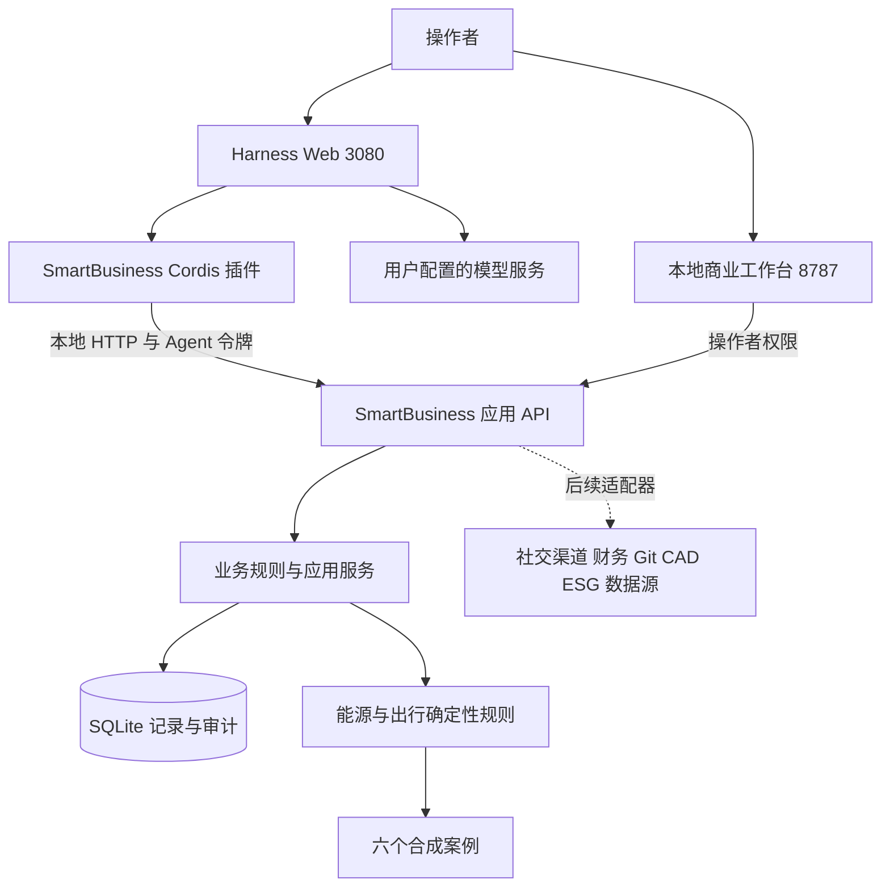

# 02 架构与工具契约

本地架构先验证一个垂直切片：操作者或 Agent 整理输入 → 应用服务验证并持久化 → 领域函数评估 → 工作台呈现证据和缺口。技术栈采用 Python 标准库、SQLite、原生响应式 Web 和独立 Harness 插件，不将本轮原型等同于已实现的生产架构。

## 1. 运行结构



Harness 工具按官方 `apply(ctx)` 和 `ctx.tools.register(...)` 插件机制装配。插件路径使用启动器生成的绝对路径覆盖配置，避免因工作目录变化加载错误模块。[官方插件机制](https://deepseek-harness.github.io/deepseek-harness/en/develop/basic/)

两个界面属于同一个业务原型的两个入口，尚未实现一个统一登录和嵌入式聊天界面。工作台是业务事实入口，Harness 会话为协作入口。

## 2. 命令与查询合同

插件名为 `smartbusiness`，注册 11 个工具：`sb_dashboard`、`sb_case`、`sb_evaluate_case`、`sb_capture_signal`、`sb_propose_opportunity`、`sb_add_resource`、`sb_draft_content`、`sb_add_contact`、`sb_record_note`、`sb_create_task`、`sb_record_task_result`。下表使用业务动作名描述其语义，`review_content` 只在操作者界面提供，不注册为 Agent 工具。实际参数、枚举与错误码以仓库中的服务及插件 schema 为准，升级时必须同步契约测试。

|动作|输入要点|输出与状态|允许主体|
|---|---|---|---|
|读取业务概览|无业务变更参数|记录统计和最近状态|操作者、Agent|
|列出/评估行业案例|仓库支持的案例标识|合成标志、计算、缺口和就绪状态|操作者、Agent|
|evaluate_case|案例标识、可选收入及已有成本项替换，金额用十进制字符串|新的合成情景评估，原案例保持不变|操作者、Agent|
|capture_signal|标题、行业、来源与内容|情报记录|操作者、Agent|
|propose_opportunity|问题、价值假设与市场线索|候选商机|操作者、Agent|
|add_resource|资源主体与能力描述|待核验资源|操作者、Agent|
|add_contact|联系人和联络信息|本地客户记录|操作者、Agent|
|record_note|联系人或业务关联、笔记|本地沟通记录|操作者、Agent|
|draft_content|内容标题、正文、行业/用途|营销草稿|操作者、Agent|
|review_content|内容对象、审核决定与意见|内部审核结果|仅操作者|
|create_task|商机引用、类型、标题与验收条件；类型限 software/hardware/contract/esg|执行工作项|操作者、Agent|
|record_task_result|任务标识、结果与资料引用|结果记录；不外部执行|操作者、Agent|

所有写入携带幂等键。服务端完成身份、权限、字段和业务状态检查，单次事务包含写入与审计；不能因工具 schema 已校验就省略服务端校验。通过 Agent 令牌访问操作者专用命令必须失败。

HTTP 合同：

|方法与路径|用途|
|---|---|
|GET /health|最小存活状态|
|GET /api/dashboard|读取记录、行业概览与运行提示|
|GET /api/cases/{id}|读取指定合成案例及评估|
|POST /api/commands|执行允许的业务操作|

命令请求结构如下，响应包含 `result` 和 `replayed`：

```json
{
  "operation": "capture_signal",
  "payload": {
    "case_id": "EN-H01",
    "title": "演练：家庭关键负载备电需求",
    "source_url": "https://example.com/interview/1",
    "excerpt": "演练数据，尚未进行真实客户访谈。",
    "customer_problem": "候选问题：停电期间关键负载需要供电"
  },
  "idempotency_key": "practice-signal-001"
}
```

调用者不能通过请求体中的 `actor` 获得操作者身份。工作台浏览器使用 HttpOnly、SameSite=Strict cookie；插件使用 Bearer 令牌且固定映射为 Agent。浏览器写入还要求同源 Origin；HTTP 层检查 Host、来源、体积和 JSON 结构。

“工具完成”仅表示本地 API 完成所描述的动作。网络超时后先用同一幂等键重试，不能把不确定状态解释为失败后换新键再次创建。外部动作上线后还需要 Outbox/Inbox、回执和对账机制；当前本地原型没有承担这些分布式保证。

## 3. 数据与模型输出

- SQLite 保存业务记录和操作轨迹；行业示例 JSON 为合成测试输入，不写成真实交易记录。
- 本轮新情报和资源仍按六个 `case_id` 归入行业试点模板；这个关联用于整理资料，不会把模板中的虚构供应商、报价、收益或核验结果继承为真实事实。生产需要独立的真实项目标识与版本，不能长期以样例 ID 代替真实项目聚合。
- API 返回结构化结果，Agent 用原结果解释计算口径。金额使用既有 Decimal 领域规则，不让语言模型承担金额运算的权威实现。
- 能源侧保留电量、热量、功率、电费基线的不同单位；出行侧保留自行车、摩托和改装路线。模型不能凭语言近似合并。
- 每条情报保留来源，商机保留假设。待核验资料进入核验队列；任务结果中的“已完成”说明不能替代真实验收签字。
- 业务事实版本和操作者决定保存在业务层，会话丢失或模型更换不应丢失业务事实。

## 4. 凭据与运行边界

本轮服务只绑定 `127.0.0.1`。业务 API 使用本地令牌并检查请求来源，令牌和 SQLite 存储在被 Git 忽略的 `.smartbusiness/`。Harness 插件从启动进程环境取得业务访问凭据，模型 API 密钥由用户在 Harness 配置，不写入仓库、案例、提示词或测试日志。

当前操作者/Agent 区分是**本地单用户原型的基础权限**，不是生产 IAM、多租户或可信设备隔离。拥有本机文件权限的程序仍可能读取本地资料；SQLite 审计也不是防篡改日志。

SmartBusiness 插件使用官方 `ctx.tools.guard()` 对 11 个工具作精确白名单检查，拒绝工具管线中的 shell、文件、`run_code` 和伪造 `sb_` 前缀调用；启动器设置 `DSH_TOOLS_MODE=native`，避免与被禁止的 PTC 路径混用。这个执行保护已有真实 ToolRuntime 测试，**仍不能证明整个 Harness 已被沙箱化**：其他插件可能仍显示在界面中，同进程插件、宿主程序和操作系统权限不是这个 guard 的隔离对象。工作目录也不能代替操作系统隔离。生产部署需要将运行时置于独立容器或虚拟机、移除不必要能力、限制网络出口、使用短期能力凭证，业务服务独立执行授权。当前原型没有实现这些生产控制。

## 5. 架构决策

|编号|本轮决定|原因与代价|重新评估条件|
|---|---|---|---|
|HADR01|Harness 作为可替换的 AI 编排层|利用现成会话与插件；承担开发者预览升级成本|工具契约发生破坏性升级或运行质量不足|
|HADR02|确定性领域代码独立于提示词|能够通过测试重现规则和算术；需要维护领域模型|规则变化时先改验收样例和版本|
|HADR03|本地 Python + SQLite 先实现可运行切片|可复用两行业内核；不代表生产 Java 方案已迁移|确定团队、并发、部署和安全要求后评估|
|HADR04|响应式 Web 先验证任务流|桌面浏览器便于试点；未交付五端原生能力|关键流程稳定后做五端可用性和插件 PoC|
|HADR05|Agent 只能创建草稿与待核验记录|防止生成内容被当作已证实事实；需操作者补齐核验|有责任人、真实证据和授权策略才扩展自动化|
|HADR06|应用令牌与模型凭据分离|业务授权可独立演进；需要两类配置|生产改为服务身份与用户委托凭据|

这些决定用于本轮原型，不覆盖[通用 ADR](../12-架构决策记录.md)中的生产候选设计。
