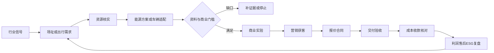

# 05 行业 DDD 模型与追踪

## 1. 公共能力与边界

复用 BC01–BC17 的情报、需求、资源、模式、营销、交易、合同、工程、利润、ESG 与治理，不复制两个 CRM/合同系统。

新增候选逻辑边界：
- EN01 能源场址与方案：SiteAssessment、LoadProfileVersion、EnergyPlan、TariffVersion、FeasibilityResult。
- EN02 能源交付与计量：CommissioningCase、MeteringPeriod、PerformanceBaseline、MeasurementReview。
- MO01 车型与适配：MobilityNeed、MarketRuleProfile、VehicleConfiguration、CompatibilityAssessment。
- MO02 安装与车辆服务：ConversionWorkOrder、DonorBikeBaseline、DeliveryInspection、WarrantyCase/RecallLink。

本次只实现可执行规则与案例应用层，并非完整四个领域服务。

|模型|不变量与实现|
|---|---|
|EnergyPlan|方案输入固定快照；电池、并网、热状态分别校验|
|EnergyState|不可变电/热存量值对象，效率、损耗与区间时长显式|
|GridExchange|基线与方案共用购售电分解与费用规则|
|MeasurementReview|完整计费周期和可比末态才输出对应节省，未实现日历完整度证明|
|VehicleConfiguration|车型路线分离，不返回 road_legal|
|CompatibilityAssessment|市场、修订、证据类型、有效期、引用一致|
|ResourceOffer|能力与报价均有效才进入候选|
|ProfitSnapshot|Decimal、退款、直接/可变成本；缺失或估计明确标记|
|BusinessCycle|内存模拟阶段与证据引用，同事件同内容幂等；无真实授权/数据库|

charge_kw/discharge_kw 在交流侧，pv_kw 为可用交流光伏功率；load_kw 不含已单列 hp_input_kw。thermal_* 与 heat_demand_kw 为热侧量，电池用 kWh_e、储热用 kWh_th。不得把组件 DC 标称功率直接当交流出力。

## 2. 行业价值流

“计算通过”不会触发设备控制、采购或外发。缺口由责任人补证据/修订，不按流程按钮伪造事实。

## 3. 需求—规则—测试

|编号|验收规则|关键测试函数|
|---|---|---|
|ENR01|备电峰值和能量分别满足|test_power_constraint_independent_of_capacity；test_backup_cannot_count_unavailable_grid_or_unproven_solar|
|ENR02|效率与预留 SoC 不重复/遗漏|test_losses_and_cycle_energy_are_accounted；test_energy_reserve_is_not_free_capacity|
|ENR03|电热分账与守恒|test_thermal_and_electric_ledgers_are_separate；test_heat_cannot_be_created_without_input|
|ENR04|并网限额及充电负荷进入核算|test_export_limit_checked；test_complete_period_uses_actual_peak_including_charging|
|ENR05|不完整计费期、不等末态不误报收益|test_incomplete_billing_period_cannot_claim_demand_savings；test_unequal_end_energy_does_not_claim_comparable_savings；test_commercial_observation_not_annualized|
|ENR06|资源证据时效/地区/版本一致|test_expired_offer_cannot_be_selected；test_wrong_market_evidence_does_not_match|
|ENR07|安装和质保计入经营成本|test_household_costs_include_installation_and_warranty|
|MOR01|未知市场不判断可上路|test_unknown_market_never_becomes_road_approval|
|MOR02|自行车/摩托分路|test_motorcycle_has_separate_route；test_higher_power_bicycle_not_silently_relabelled|
|MOR03|按工况给续航区间|test_range_is_interval_not_guaranteed_mileage；test_range_under_required_duty_cycle_is_flagged|
|MOR04|改装需原车与组合证据|test_conversion_requires_donor_frame_evidence；test_kit_document_for_other_revision_is_not_valid|
|MOR05|缺成本与估算不伪装实际利润|test_missing_cost_never_becomes_zero；test_estimates_are_not_actual_profit|
|XIR01|事件幂等与成本去重|test_business_cycle_idempotent_replay；test_duplicate_cost_id_is_rejected|
|XIR02|内容和市场门槛|test_content_edit_or_market_unknown_blocks_publication|
|XIR03|合成闭环与真实业务隔离|test_complete_synthetic_cycle_requires_all_gates；test_real_transactions_not_accepted_by_demo_runner|

其他测试覆盖非有限输入、错误效率、同时充放等。[领域测试](../../../tests/test_industry_pilots.py) / [案例测试](../../../tests/test_industry_scenarios.py)。

## 4. 生产协议候选

POST /v1/energy-assessments：场址、负荷/电价/设备版本和地区审核引用。
POST /v1/mobility-assessments：需求、整车/原车/套件版本、市场和证据。
GET /v1/industry-opportunities/{id}/readiness：技术、市场、供给、内容和经济的独立状态。

当前仅提供本地函数/JSON，不提供 HTTP、身份认证或持久化。真实审核必须由受控服务签发并校验人员权限、对象版本和证据真伪，不能信任客户端传入 verified=true。

## 5. 实现边界

能源模型是给定计划的约束校验，不是最优调度；未实现季节退化、温度、启动瞬态、实际保护或完整动态电价。
出行模型是工况与资料筛选，不包含车辆型式试验、结构计算或当地法规全量规则。
BusinessCycle 只验证样例阶段顺序与幂等；生产需要各领域真实事件、授权、合同与收付款证据。
